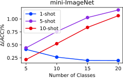
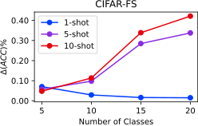
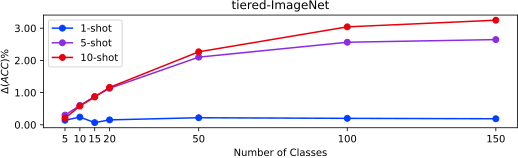

# Firth Bias Reduction on Cosine Classifiers with S2M2R Features 
This repository contains the firth bias reduction experiments with S2M2R feature backbones and cosine classifiers. The theoretical derivation of the Firth bias reduction term on cosine classifiers is shown in our paper ["On the Importance of Firth Bias Reduction in Few-Shot Classification"](https://openreview.net/pdf?id=DNRADop4ksB). This is one of the three code repositories of our paper, and is a sub-module of the the main ["Firth Bias Reduction in Few-Shot Learning" repository](https://github.com/ehsansaleh/firth_bias_reduction). 

For a concise and informal description of our work, check out our paper's website: [https://ehsansaleh.github.io/firthfsl](https://ehsansaleh.github.io/firthfsl)

Here is the effect of Firth bias reduction on cosine classifiers and S2M2R feature backbones.

 
    


<details>
<summary><h2>Quick Q&A Rounds</h2></summary>

1. **Question**: Give me a quick-starter code to start reproducing the paper trainings on a GPU?
   ```bash
   git clone --recursive https://github.com/ehsansaleh/firth_bias_reduction.git
   cd ./firth_bias_reduction/code_s2m2rf
   ./features/download.sh
   ./main_firth.sh
   ```
---------
2. **Question**: Give me a simple python command to run?
   ```bash
   python main_firth.py --proc_rank 0 --proc_size 1 --configid "1_mini_co_part0"
   ```

    <details>
    <summary><strong>More Information</strong></summary> 
    
      * This will run the configuration specifed at [`./configs/1_mini_co_part0.json`](./configs/1_mini_co_part0.json).
      * This will store the generated outputs periodically at `./results/1_mini_co_part0/1_mini_co_part0_r0.csv`.
      * Alternatively, you can launch `N` parallel processes and distribute the work-load among them:
        ```bash
        python main_firth.py --proc_rank 0 --proc_size 4 --configid "1_mini_co_part0" &
        python main_firth.py --proc_rank 1 --proc_size 4 --configid "1_mini_co_part0" &
        python main_firth.py --proc_rank 2 --proc_size 4 --configid "1_mini_co_part0" &
        python main_firth.py --proc_rank 3 --proc_size 4 --configid "1_mini_co_part0" &
        wait
        ```
     </details>

---------
3. **Question**: How can I reproduce the paper figures/tables?

   ```bash
   make summary
   make figures
   make tables
   ```
  
   <details>
   <summary><strong>More Information</strong></summary>
   
   1. If you have run new classifier trainings by either `./main_firth.sh` or `python main_firth.py`, then run `make summary`. Otherwise, skip this step. This command will collect the csv files from the `./results` directory, and process them into a single summarized file at [`./summary/val2test.csv`](./summary/val2test.csv).
   2. Run `make figures` to refresh the PDF figures at the [`./figures`](./figures) directory.
   3. Run `make tables` in case you're interested about the raw numbers at the [`./tables`](./tables) directory.
   
   </details>


---------
4. **Question**: I have my own code and I do not want to use your code. How can I apply the Firth bias reduction to my own loss?

   ```python
   ce_loss = nn.CrossEntropyLoss()
   ce_term = ce_loss(logits, target)
  
   log_probs = logits - torch.logsumexp(logits, dim=-1, keepdim=True)
   firth_term = -log_probs.mean()
  
   loss = ce_term + lam * firth_term
   loss.backward()
   ```
   
   * Alternatively, you can use the `label_smoothing` keyword argument in [`nn.CrossEntropyLoss`](https://pytorch.org/docs/stable/generated/torch.nn.CrossEntropyLoss.html). 
  
   * Remember that this Firth formulation is only true for 1-layer logistic and cosine classifiers. For more complex networks, the FIM's log-determinant must be worked out.
  
---------
   <details>
   <summary>4. <strong>Question:</strong> You seem to have too many directories, files, and a fancy structure. Explain the whole thing as simple as possible?</summary>
   
   
     
   ```
                  ./main_firth.sh or
                 python main_firth.py              make summary                  make figures    
   configs/*.json ================> results/*.csv =============> summary/*.csv ===============> figures/*.pdf
                         /\                                                       make tables      tables/*
                         ||
            (below is    ||
             optional    ||
              parts)     ||
                         ||                        python save_features.py                   
                         ======= features/*.hdf5 <========================== checkpoints/*.tar
                                                                                   /\
                                                                                   ||
                                                                                   ||
                                                              python train.py ============== Datasets/*
                                                          or python train_cifar.py
   ```

   The top horizontal line is the important one for our work.

   </details>
  
---------
   <details>
   <summary>5. <strong>Question:</strong> What are the python environment package requirements?</summary>
   
   * We ran the code using `python 3.8`.
     
   * The classifier training code mainly needs `numpy`, `torch`, `torchvision`, and `pandas`.
     
   * For generating the figures, you also need `matplotlib`, `seaborn`, etc.
     
   * If you don't like messing up with your own environment, just run `make venv` in the terminal. This will create a virtual environment at `./venv` and install our specified dependencies. Our shell scripts (e.g., `./main_firth.sh`) will automatically activate and use this environment once it exists.
     
   * If you'd like our shell scripts to use and activate your own conda/virtualenv environment, feel free to edit the `.env.sh` under the environement activation section and add your custom activation lines. We source the `.env.sh` code in all of our shell scripts, so your changes will automatically have a global effect.
     
   </details>

</details>

<details open>
<summary><h2>Step-by-Step Guide to the Code</h2></summary>
   
+  <details>
   <summary><strong>Cloning the Repo</strong></summary>
   
   +  <details open>
      <summary><strong>[Option 1] Cloning All Three Repositories of Our Paper</strong></summary>
 
      1. `git clone --recursive https://github.com/ehsansaleh/firth_bias_reduction.git`
      2. `cd firth_bias_reduction/code_s2m2rf`
      </details>
 
   +  <details>
      <summary><strong>[Option 2] Cloning This Repository Alone</strong></summary>
 
      1. `git clone https://github.com/ehsansaleh/code_s2m2rf.git`
      2. `cd code_s2m2rf`
      </details>

   </details>
   
+  <details>
   <summary><strong>Download the Features</strong></summary>

   1. To use our pre-computed features, run `./features/download.sh`

   </details>
   
+  <details>
   <summary><strong>[Optional] Make a Virtual Environment</strong></summary>
   
   1. Activate your favorite python version (we used 3.8).
   2. Run `make venv`.
   3. This will take a few minutes, and about 1 GB in storage.
   4. The virtual environment with all dependencies will be installed at `./venv`.
   5. You can run `source ./venv/bin/activate` to activate the venv.
   6. Our shell scripts check for the existence of `venv`, and will use/activate it.
   
   </details>

+  <details>
   <summary><strong>Training Few-shot Classifiers</strong></summary>
   
   +  <details>
      <summary><strong>[Manual Approach]</strong></summary>
   
      * To fire up some training yourself, run

        `python main_firth.py --proc_rank 0 --proc_size 1 --configid "1_mini_co_part0"`
      * This command will read the `./configs/1_mini_co_part0.json` config as input.
      * The computed accuracy statistics would be saved at  `./results/1_mini_co_part0/1_mini_co_part0_r0.csv`.
      * This python code runs on CPU. To speed it up, you can launch `N` parallel processes and distribute the work-load among them:
        ```bash
        python main_firth.py --proc_rank 0 --proc_size 4 --configid "1_mini_co_part0" &
        python main_firth.py --proc_rank 1 --proc_size 4 --configid "1_mini_co_part0" &
        python main_firth.py --proc_rank 2 --proc_size 4 --configid "1_mini_co_part0" &
        python main_firth.py --proc_rank 3 --proc_size 4 --configid "1_mini_co_part0" &
        ```
      </details>
   
   +  <details open>
      <summary><strong>[Shell Script's Automated Array]</strong></summary>

      * Check-out and run [`./main_firth.sh`](./main_firth.sh).
      * The shell script performs some inital sanity checks and activations.
      * Then it will run the `1_mini_co_part0` till `1_mini_co_part5` array sequentially.
      * This script will detect the number of CPU cores you have on your machine(`NCPU`), and launch `NCPU/2` parallel processes to distribute the config's load among multiple cores.
      * You can modify the number of parallel processes (`NCPU`) in the script if you think your CPU is under- or over-threaded.
      * After `1_mini_co` config parts, the script will run the `2_cifar_co` and `3_tiered_co` config parts. Feel free to add or take off configs from this sequence of execution. 
      </details>
   
   </details>

+  <details>
   <summary><strong>Summarizing the Results</strong></summary>

   Run `make summary` 
   +  <details>
      <summary><strong>The Summary Output</strong></summary>

      This step generates the following 3 files.
      1. [`./summary/val.csv`](./summary/val.csv) summarizes the accuracy statistics on the validation split.
      2. [`./summary/test.csv`](./summary/test.csv) summarizes the accuracy statistics on the novel split.
      3. [`./summary/val2test.csv`](./summary/val2test.csv) summarizes what happens when you validate the coefficients.
         * That is, what the accuracy improvements are when you pick the best coefficient from the validation set and apply it to the novel set.

      You can use these summarized CSV files to generate your own plots. Basically, `./summary/val2test.csv` has all the data we showed in our paper!
      </details>
   
   +  <details>
      <summary><strong>More Information</strong></summary

      Here are some pointers to understand what `make summary` just did:
      1. In the previous step, you have run a bunch of Few-shot classification tasks 
         1. on both the validation and novel sets,
         2. both when the firth bias reduction was turned on or off,
         3. etc.
      2. The statistics for each task were computed and stored in csv files in the results directory.
      3. Now, you wish to see how much difference Firth or L2 made, and perform validation to pick the best coefficient. 
         * This is what we call the summarization step.
      3. During the summarization:
         1. we take all the generated `./results/*.csv` files from the previous step,
         2. summarize them into a single small csv file at [`./summary/val2test.csv`](./summary/val2test.csv). 
      4. The [`./summary/val2test.csv`](./summary/val2test.csv) file includes
         1. the validated coefficients, 
         2. the average un-regularized accuracy values,
         3. the average accuracy improvement at test time, and
         4. what the error/confidence intervals look like

      as response columns. Each row will denote a specific configuration (e.g., dataset, number of shots, number of ways, etc. combination) averaged over many seeds.
      </details>

   </details>

+  <details>
   <summary><strong>Generating Our Figures</strong></summary>
   
   Run `make figures`. 
   
   * This will refresh the contents of the `figures` directory with new pdf plots.
   
   </details>

+  <details>
   <summary><strong>Generating Our Tables</strong></summary>

   Run `make tables`. 
   
   * This will refresh the contents of the `tables` directory with new tex/csv tables.
   
   </details>

+  <details>
   <summary><strong>[Optional] Download The Pre-trained Feature Backbone Parameters</strong></summary>
   
   Run  `./checkpoints/download.sh`
  
    * These files were produced by the S2M2 project, and published at [their google drive](https://drive.google.com/drive/folders/1S-t56H8YWzMn3sjemBcwMtGuuUxZnvb_). The `./checkpoints/download.sh` only automates the downloading and placement process.
   
   </details>

+  <details>
   <summary><strong>[Optional] Downloading and Extracting the Datasets</strong></summary>
   
      Run `./Datasets/download.sh`
      
      1. Before you start, you should know that this can take a long time and a lot of storage.
  
         * For mini-imagenet, the download size is about 6.28 GBs, and the tar ball gets extracted to 60,000 files.
  
         * For CIFAR-FS, the download size is about 161 MBs, and the tar ball gets extracted to 60,000 files.
  
         * For CUB, the download size is about 1.06 GBs, and the tar ball gets extracted to 11,788 files.
  
         * For tiered-imagenet, the download size is about 82 GBs (divided into 6 download parts), and it ends up creating 779,165 files.
  
      2. This shell script will download and extract the mini-imagenet and CIFAR-FS datasets by default.
         
      3. For tiered-imagenet, you can run `./Datasets/download.sh tiered`.
        
         * We suggest that you first do a plain `./Datasets/download.sh` run, since the other datasets are smaller to download and easier to check.
            
         * The tiered-imagnet dataset that we used is about 82GBs after compression into a single tar-ball. 
  
         * We divided this tar-ball into 6 parts, and the shell script will take care of stitching them together for extracting the images. 
  
         * If you want to save space after everything was extracted, you can manually remove these downloaded part files.
      
      4. The script checks the existence and the MD5 hash of the downloaded files before downloading them. 
  
         * If the files already exist and are not damaged, the script will exit gracefully without downloading or extracting any files. 
         
   </details>

+  <details>
   <summary><strong>[Optional] Generating the Datasets filelists</strong></summary>
   
      Run `make filelists`
      
      1. You need to have the datasets downloaded and extracted before performing this step.
  
      2. One of the generated outputs is `./filelists/miniImagenet/base.json`.
 
         * The [`filelists/download.sh`](./filelists/download.sh) script downloads a set of template json filelists. 
           * The template json files include a list of image filenames and labels in the order we used them.
           * The template json files only include relative image paths, which should be converted to absolute paths using the `filelists/json_maker.py`](./filelists/json_maker.py) script.
  
         * The [`filelists/json_maker.py`](./filelists/json_maker.py) script generates these json files for all the `base`, `val`, and `novel` splits, and all the `miniImagenet`, `tieredImagenet`, `CUB` and `cifar` datasets by default.
  
         * You can specify your own list of splits and datasets at [`filelists/json_maker.py`](./filelists/json_maker.py) if you do not want all of the combinations to be generated. Look for and modify the `dataset_names` and `splits` variables to your liking in the python script.
  
         * The [`filelists/json_maker.py`](./filelists/json_maker.py) script makes random checks for the existence of the actual image files with a 1 percent chance.
     
      3. The S2M2 python scripts (e.g., `train.py` and `save_features.py`) use the generated `json` files as a reference for construcing datasets and data-loaders in pytorch. 
         
   </details>

+  <details>
   <summary><strong>[Optional] Train Feature Backbones</strong></summary>
    
    * For the `miniImagenet`, `CUB`, and `tieredImagenet` datasets, run

      ```bash
      source .env.sh
      python train.py --dataset <dataset_name> --method <method_name> --model WideResNet28_10 \
                      --batch_size <batch_size> --stop_epoch <stop_epoch>
      ```
  
    * For the `cifar` dataset, run
  
      ```bash
      source .env.sh
      python train_cifar.py --method <method_name> --model WideResNet28_10 \
                            --batch_size <batch_size> --stop_epoch <stop_epoch>
      ```

    * This `train.py` and `train_cifar.py` scripts were written by the `[S2M2 project](https://github.com/nupurkmr9/S2M2_fewshot).
  
    * The `dataset_name` can be chosen from `miniImagenet`, `tieredImagenet`, and `CUB`.
  
    * The `method_name` can be chosen from `rotation`, `manifold_mixup`, and `S2M2_R`.
  
    * This will store the checkpoints at `./checkpoints/miniImagenet/WideResNet28_10_S2M2_R/*.tar`.
  
    * The code has resuming capability from the checkpoints.
  
    * For more training options, look at the [`io_utils.py`](./io_utils.py) script.
   
   </details>

   
+  <details>
   <summary><strong>[Optional] Generate Features from Trained Backbones</strong></summary>
   
     * Here is a minimal python example:
       ```bash
       source .env.sh
       python save_features.py --dataset <dataset_name> --split <split_name> \
                               --method <method_name> --model WideResNet28_10 --save_iter -1
       ```
  
     * This `save_features.py` was written by the [S2M2 project](https://github.com/nupurkmr9/S2M2_fewshot).

     * The `split_name` can be chosen from `val`, `novel`, and `base`.
     
     * The `dataset_name` can be chosen from `miniImagenet`, `tieredImagenet`, `cifar`, and `CUB`.
  
     * The `method_name` can be chosen from `rotation`, `manifold_mixup`, and `S2M2_R`.
  
     * The `save_iter` argument is specified to `-1` to take the best existing checkpoint.
        
        * Remember to specify `save_iter` if you want to use your own trained checkpoints. 
  
        * Leaving `--save_iter -1` will likely cause the script to use the pre-trained checkpoints you had downloaded.
  
        * If you absolutely do not want to use the pre-trained/downloaded checkpoints, make sure you remove them from the [`checkpoints`](./checkpoints) directory before running this script.
  
   </details>

</details>
   
<details>
<summary><h2>Configurations and Arguments</h2></summary>

+ <details open>
  <summary><strong>Example</strong></summary>

  We have included all the configurations we used to produce the results in our paper in the [`./configs`](./configs) directory. 

  There are a total of 23 json configuration files for our paper. There are 6 parts for `miniImagnet`, 6 parts for `cifar`, and 11 parts for `tieredImagenet`.

  You can take a look at [`configs/01_mini_co_part0.json`](configs/01_mini_co_part0.json) for an example:
  ```json
  {
    "start_seed" : 0,
    "num_seeds" : 20,
    "n_shot_list" : [5, 10],
    "n_way_list" : [5, 10, 15, 20],
    "split_list" : ["val", "novel"],
    "dataset_list" : ["miniImagenet"],
    "method_list" : ["S2M2_R"],
    "model_list" : ["WideResNet28_10"],
    "firth_c_list" : [0.0, 0.1, 0.3, 1.0, 3.0, 10.0, 30.0, 100.0],
    "iter_num" : 100,
    "torch_threads" : 2,
    "fine_tune_epochs" : 100
  }
  ```
  
  * Note that our code runs the cartesian product of all arguments ending with `_list`. 
    * For instance, there is `128=2*4*2*1*1*1*8` different settings to try in the above config file.
    * Each of these settings runs with 20 different initial random seeds for 100 iterations, creating a total of 256,000 tasks to perform.
  </details>
  
+ <details>
  <summary><strong>Brief Argument Descriptions</strong></summary>
  
  * `"start_seed"` and `"num_seeds"` determine the range of random seeds that will be run.
    * Having `"start_seed" : 0, "num_seeds" : 1000` runs all the `0, 1, 2, 3, ..., 999` seeds.
    * Since we use randomized effect matching, you don't need 10,000 seeds for improvement stats.
  * `"dataset_list"` is a list of dataset names:
    * It should be a subset of `["miniImagenet", "cifar", "tieredImagenet"]`.
  * `"split_list"` is a list of data splits to go through:
    * It should be a subset of `["base", "val", "novel"]`.
  * `"n_shot_list"` specifies a list of number of shots to test.
  * `"firth_coeff_list"` specifies a list of firth bias reduction coefficients to iterate over. 
    * Please note that we train a model for each coefficient, and evaluate its accuracy. 
    * Later on, we use this information to perform the validation procedure when we summarize the results.
  * `"n_way_list"` specifies a list of number of classes to perform few-shot classification tasks over.
  * `"iter_num"` is the number of iterations the same process gets repeated.
    * You can think of this as a multiplier in the number of seeds.
  * `"fine_tune_epochs"` is the number of epochs the classifier optimizer iterates over the support data.
  * `"torch_threads"` sets the number of torch threads.

  </details>

</details>

<details>
<summary><h2>Extra Inner-working Details</h2></summary>

+ <details>
  <summary><strong>Downloading the Files</strong></summary>

    You can find the google-drive download link embedded in the download shell-scripts. For example, take the following snippet from the [`./features/download.sh`](./features/download.sh) script:
     ```commandline
     FILEID="1Z-oO1hvcZkwsCZo9n7R3UGwHvFLi6Arf"
     FILENAME="s2m2r_features.tar"
     GDRIVEURL="https://drive.google.com/file/d/1Z-oO1hvcZkwsCZo9n7R3UGwHvFLi6Arf/view?usp=sharing"
     PTHMD5FILE="s2m2r_features.md5"
     REMOVETARAFTERDL="1"
     gdluntar ${FILEID} ${FILENAME} ${GDRIVEURL} ${PTHMD5FILE} ${REMOVETARAFTERDL}
     ```
     This means that you can manually
     1. download the file from [`https://drive.google.com/file/d/1Z-oO1hvcZkwsCZo9n7R3UGwHvFLi6Arf/view?usp=sharing`](https://drive.google.com/file/d/1Z-oO1hvcZkwsCZo9n7R3UGwHvFLi6Arf/view?usp=sharing),
     2. name it `s2m2r_features.tar`,
     3. optionally, verify its checksum from `s2m2r_features.md5`, and then
     4. untar it yourself, and you'll be in business!
     5. The `REMOVETARAFTERDL=1` option causes the script to remove the downloaded tar file upon completion.

    The function `gdluntar` from [`./utils/bashfuncs.sh`](./utils/bashfuncs.sh) is used to automatically download the files. We have been using this method for downloading google-drive files for quite a few years, and it's been stable so far. In the event there was a breaking change in google's api, please let us know and feel free to edit this function if you know a better G-drive download method in the meantime.
  
  </details>

+ <details>
  <summary><strong>Python Environments and Libraries</strong></summary>

  The [`.env.sh`](./.env.sh) checks for the existence of this virtual environment, and if it detects its existence, it will automatically activate and use it in our shell scripts. You can change this behavior by replacing the `[[ -f ${SCRIPTDIR}/venv/bin/activate ]] && source ${SCRIPTDIR}/venv/bin/activate` line with your own custom environment activation commands (such as `conda activate` or similar ones).

  </details>
  
</details>
 
<details>
<summary><h2>Nice Code Features</h2></summary>

  We tried to structure the code as **user-friendly** as possible. Following features are worth considerations:
  1. **Data Inclusion**: All the data needed to produce the figures and tables, including  
     1. the extracted features,
     2. the feature backbone parameters,
     3. the datasets,
     4. the experimental results and data,
     5. the generated figures and tables, etc.

      are either included in the repository themselves, or a google-drive link to them with automated downloading scripts is included.
  2. **Download Automation**: Downloading heavy feature files, datasets, or backbone parameters manually, and then transferring them to a cluster storage can be difficult and time-consuming. To alleviate this, we included automated downloading scripts for each of these elements. Just take a look at [`./features/download.sh`](./features/download.sh) or [`./Datasets/download.sh`](./Datasets/download.sh) or [`./checkpoints/download.sh`](./checkpoints/download.sh); all the google drive links are included, a script will download them for you, and verify their correctness using the md5 checksums included in the repo. These scripts were tested multiple times at the time of writing, and if a breaking update happens to the google-drive api in the future, we will modify the download code to fix the issue as soon as you let us know!
  3. **Python Environment Specification**: Not only we provide our exact python library dependencies and versions in the [`requirements.txt`](./requirements.txt) file, we also offer some automated helper scripts to create virtual environments. If you'd rather run your code in an environment of your choosing, that is totally fine as well.
  4. **Reproducibility and Random Effects Matching**: All the randomization effects (such as the batch ordering, the parameter initializations, etc.) are controlled through rigorous seeding of the random generators. The results are tested to be deterministically reproducible (i.e., running the same code 10 times will give you the same exact result every time). This can be useful if you want to make a slight algorithmic change, and observe the difference; all the randomized effects will be matched between the two runs.

  Just give this code a try; it won't take much of your time to set up. You may even find it a good starting point for your own project :)
</details>
 
## Code Origins 
  * This repository is based upon the [S2M2 Charting the Right Manifold: Manifold Mixup for Few-shot Learning](https://github.com/nupurkmr9/S2M2_fewshot) code. 
  * The original readme file of the S2M2 repository was moved to [S2M2_README.md](./S2M2_README.md).
  * We have added a few missing directories ([`checkpoints`](./checkpoints), [`features`](./features), and [`Datasets`](./Datasets)) along with their downloading shell scripts to help you populate them as quickly as possible.
   
## References
* Here is the arxiv link to our paper:
  * The arxiv PDF link: [https://arxiv.org/pdf/2110.02529.pdf](https://arxiv.org/pdf/2110.02529.pdf)
  * The arxiv web-page link: [https://arxiv.org/abs/2110.02529](https://arxiv.org/abs/2110.02529)
* Here is the open-review link to our paper:
  * The open-review PDF link: [https://openreview.net/pdf?id=DNRADop4ksB](https://openreview.net/pdf?id=DNRADop4ksB)
  * The open-review forum link: [https://openreview.net/forum?id=DNRADop4ksB](https://openreview.net/forum?id=DNRADop4ksB)
* Our paper got a spot-light presentation at ICLR 2022.
  * We will update here with links to the presentation video and the web-page on `iclr.cc`.
* Here is a web-page for our paper: [https://ehsansaleh.github.io/firthfsl](https://ehsansaleh.github.io/firthfsl)
* Here is the bibtex citation entry for our work:
```
@inproceedings{ghaffari2022fslfirth,
    title={On the Importance of Firth Bias Reduction in Few-Shot Classification},
    author={Saba Ghaffari and Ehsan Saleh and David Forsyth and Yu-Xiong Wang},
    booktitle={International Conference on Learning Representations},
    year={2022},
    url={https://openreview.net/forum?id=DNRADop4ksB}
}
```
